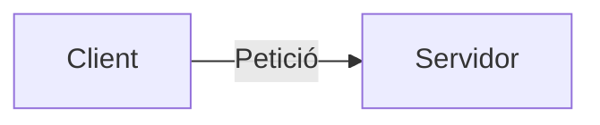

# {{title}}

## 1. Concepte i Fonaments Teòrics
Explicació detallada del tema...

---

## 2. Arquitectura i Diagrama


---

## 3. Exemples de Codi / Comandes
```php
<?php
// Codi d'exemple
```

---

## 4. Bones Pràctiques i Recomanacions
- Recomanació 1
- Recomanació 2

---

## 🔗 Referències i Enllaços d'Interès
- [[00_Meta/🧭 MOC_Principal|Tornar al MOC Principal]]
